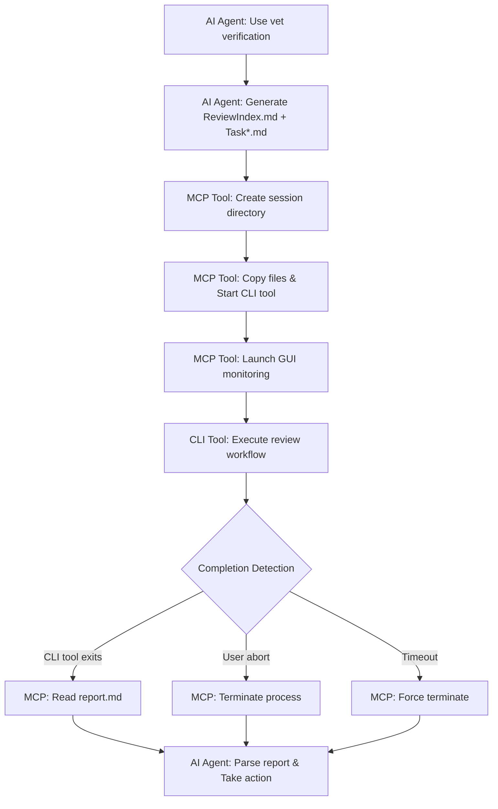

# VetMediator MCP


**[🏠 Home](../../README.md)** | **Language / 语言**: [English](../en/README.md) | [中文](../zh/README.md)

---

> **AI CLI Tool Review Coordinator** - MCP server for multi-tool code review workflows
>
> Enable AI agents (like Claude Code) to invoke other CLI review tools (like Codex, iFlow, etc.) for cross-validation

---

## ✨ Core Features

- 🤖 **Multi-Tool Support** - Support for Codex, Claude, iFlow and any CLI review tools
- 🔄 **Smart Coordination** - AI agent generates tasks → CLI tool reviews → Structured reports
- 📊 **Real-time Monitoring** - GUI window displays review progress and log output
- 🎯 **Configuration Management** - GUI interface to view tool status and switch active tools
- 📝 **Structured Reports** - P0/P1/P2 issue classification, 7-dimension quality assessment
- 🌐 **Multilingual Support** - UTF-8 encoding, supports Chinese, Japanese, emoji, etc.
- 💾 **Smart Caching** - Hash-based auto-caching of rules to save token consumption
- 🔧 **Auto Migration** - Global config auto-migrates to `~/.vetmediator/` directory

---

## 🔌 MCP Client Compatibility

**VetMediator MCP** is a standard MCP (Model Context Protocol) server that supports all MCP-compatible AI clients:

- ✅ **Claude Code** - Anthropic's official CLI tool
- ✅ **Cursor** - AI code editor
- ✅ **Codex CLI** - OpenAI code tool
- ✅ Other MCP-compatible AI tools

**How it works**: Through the MCP protocol, any MCP client can invoke other CLI review tools (like Claude Code CLI, iFlow CLI, Codex CLI, etc.) for cross-validation, achieving "AI reviews AI" code quality assurance.

---

## 🎬 Complete Workflow

### 1. Initiate Review

User requests code review through AI agent (e.g., Claude Code):


*Enter trigger words like "use vet verification", AI agent starts preparing review tasks*

### 2. Generate Task Files

AI agent generates ReviewIndex.md and multiple Task*.md files according to rules:


*Contains complete task descriptions, code comparisons, and review requirements*

### 3. View Task Details

Click "View" button to open generated task files:


*Each review creates an independent session under VetMediatorSessions directory*

### 4. Real-time Monitoring

MCP starts CLI tool and displays real-time monitoring window:


*800x600 window displays review logs in real-time, can be aborted anytime*

### 5. Generate Review Report

CLI tool generates structured report after completing review:


*Contains issue classification, suggestions, and quality scores*

### 6. Process Review Results

AI agent parses report and decides next actions:


*Choose to continue implementation or fix issues based on review results*

---

## 📚 Real Project Example

Want to see how VetMediator works in a real project?

👉 **[View Complete Example: Unity Project Code Review](../sample/README.md)**

This example demonstrates:
- Claude Code uses ultrathink for deep Unity code analysis
- Generates 8 detailed refactoring task files
- iFlow performs 310-second comprehensive review
- Identifies and fixes 4 P0-level critical bugs
- Complete interactive feedback workflow

Includes 18 real screenshots showing the entire process from analysis to review completion!

---

## 🔧 CLI Tool Configuration Management

### View Tool Status

Enter "view CLI tools" to open configuration management interface:


*View health status of all configured tools and current active tool*

### Switch CLI Tool

Click "Activate" button on other tools:


*Takes effect immediately after confirmation*

### Complete Switch

Tool switch completed, interface auto-refreshes:


*New tool activated, can continue management or close window*

---

## 🚀 Quick Start

### Prerequisites

- **Python 3.10+** - [Download](https://python.org)
- **uvx** - Python package runner (installed with uv): `pip install uv`
- **MCP-compatible AI agent** - e.g., Claude Code, Cursor, etc.
- **CLI review tool** - e.g., iFlow, Codex or Claude CLI (at least one required)

### One-Command Installation (Recommended)

👉 **[3-Minute Quick Start Guide](../QUICKSTART.md)**

Use the automated installation script to complete all configuration:

```bash
curl -sSL https://raw.githubusercontent.com/ldr123/VetMediatorMCP/master/install.sh | bash
```

**Script automatically completes**:
- ✅ Dependency check (Python 3.10+, uvx)
- ✅ Generate `.mcp.json` configuration file
- ✅ Detect installed CLI tools
- ✅ Inject usage rules to `CLAUDE.md`
- ✅ Create `VetMediatorSessions/` directory

**Verify installation**:
```bash
./verify-config.sh
```

### Manual Installation (Developers)

After cloning the repository, configure local path in `.mcp.json`:

```json
{
  "mcpServers": {
    "vet-mediator-mcp": {
      "command": "uv",
      "args": [
        "--directory",
        "/path/to/VetMediatorMCP",
        "run",
        "vet-mediator-mcp"
      ]
    }
  }
}
```

### First Use

1. Restart your AI tool (Claude Code / Cursor, etc.) to load MCP configuration
2. Enter trigger words: `use vet verification` or `使用vet验证`
3. AI tool automatically generates task files and calls MCP tool
4. Real-time monitoring window displays review progress
5. View the generated review report

---

## 📖 How It Works



---

## 📊 Review Report Format

CLI tool generates structured review reports:

```markdown
# Review Report

## Status
approved | major_issues | minor_issues

## Issues Found

### P0 - Critical Issues
- [Critical issue with file:line reference]

### P1 - Major Issues
- [Major issue with file:line reference]

### P2 - Minor Issues
- [Minor issue with file:line reference]

## Suggestions
- [Actionable improvement suggestions]

## Quality Rubric
| Dimension | Score | Notes |
|-----------|-------|-------|
| Completeness | Pass/Minor/Major/Critical | Notes for non-Pass scores |
| Correctness | Pass/Minor/Major/Critical | Notes for non-Pass scores |
| Best Practices | Pass/Minor/Major/Critical | Notes for non-Pass scores |
| Performance | Pass/Minor/Major/Critical | Notes for non-Pass scores |
| Maintainability | Pass/Minor/Major/Critical | Notes for non-Pass scores |
| Security | Pass/Minor/Major/Critical | Notes for non-Pass scores |
| Backward Compatibility | Pass/Minor/Major/Critical | Notes for non-Pass scores |

## Summary
[Overall assessment with file references, risks, and next steps]
```

---

## 🔧 MCP Tool Documentation

### start_review

Launch CLI tool review workflow.

**Parameters**:
- `review_index_path` (required): Temporary file path for ReviewIndex.md
- `draft_paths` (required): List of task file paths
- `project_root` (required): Absolute path to project root directory
- `initiator` (recommended): Name of AI tool initiating review (e.g., "Claude Code")
- `max_iterations` (optional): Maximum iteration rounds, default 3

**Returns**: Structured report containing review results

### show_cli_config

Display CLI tool configuration interface.

**Parameters**:
- `project_root` (required): Project root directory path

**Features**:
- View all configured CLI tools and their health status
- One-click switch active CLI tool
- View config file paths (global and project)

### get_review_rule_hash

Get SHA-256 hash (first 12 characters) of review rule file for local cache version detection.

**Parameters**:
- `rule_type` (optional): Rule type, default "file-generator"

**Returns**:
```json
{
  "rule_type": "file-generator",
  "hash": "a1b2c3d4e5f6",
  "description": "Rule file hash for cache validation"
}
```

**Purpose**:
- AI agents can check if locally cached rule files are up-to-date using the hash
- Avoids re-downloading rule files every time, saving token consumption

### update_review_rules

Update review rule file to specified directory.

**Parameters**:
- `dst_path` (required): Complete destination path (e.g., `/path/to/project/VetMediatorSessions`)
- `rule_type` (optional): Rule type, default "file-generator"

**Features**:
- MCP server automatically deletes old rule cache files
- Writes latest version of rule file to specified directory
- Rule documentation includes: file format specs, templates, examples, MCP call instructions

**Returns**:
```json
{
  "status": "success",
  "rule_file_path": "/path/to/project/VetMediatorSessions/vet_mediator_rule_a1b2c3d4e5f6.md",
  "hash": "a1b2c3d4e5f6",
  "message": "Rule file updated"
}
```

---

## 🔧 Advanced Configuration

### Two-Phase Review Mode

VetMediator supports two-phase reviews: **Phase 1** reviews task planning, **Phase 2** reviews code implementation.

**Enabling Method**:

Provide `original_requirement_path` and `task_planning_path` parameters when calling `start_review`:

```python
mcp__vet-mediator-mcp__start_review(
    review_index_path="...",
    draft_paths=["..."],
    project_root="...",
    original_requirement_path="/path/to/OriginalRequirement.md",  # Original requirements
    task_planning_path="/path/to/TaskPlanning.md"                  # Task planning
)
```

**Workflow**:
1. CLI tool first reviews task planning (compared with original requirements)
2. If planning passes, then reviews specific code implementation
3. Both review results included in final report

**Use Cases**:
- Complex feature development requiring planning before implementation
- Team collaboration requiring design review before code review
- High-quality requirements with dual assurance for code quality

### Custom CLI Tool Configuration

By default, VetMediator auto-detects installed CLI tools. You can also configure manually:

**Project-Level Config** (higher priority):

Create `.VetMediatorSetting.json` in project root:

```json
{
  "tools": [
    {
      "name": "iflow",
      "executable": "iflow",
      "enabled": true
    },
    {
      "name": "codex",
      "executable": "codex",
      "args": ["--custom-arg"],
      "enabled": false
    }
  ],
  "active_tool": "iflow"
}
```

**Global Config** (lower priority):

Config file location: `~/.vetmediator/config.json`

Same format as project-level config.

### Performance Optimization Tips

**1. Rule File Caching**

Rule files are automatically cached in `VetMediatorSessions/` directory:
- Filename format: `vet_mediator_rule_{hash}.md`
- Hash checked before each review, re-download only when version changes
- Recommended to add `VetMediatorSessions/vet_mediator_rule_*.md` to version control (optional)

**2. Task File Size Control**

For optimal performance:
- Single task file recommended not to exceed 1000 lines of code
- Complex features recommended to split into multiple task files
- Use `draft_paths` parameter to submit multiple tasks in order

**3. Concurrent Review Limits**

- By default, VetMediator processes one review task at a time
- For concurrency, start multiple reviews in different project directories
- Note CLI tool API rate limits

---

## 🛠️ Troubleshooting

### CLI Tool Not Found

**Symptom**: `[ERROR] CLI Tool not found`

**Solution**:
```bash
# Install corresponding CLI tool
npm install -g @iflow-ai/iflow-cli      # iFlow
npm install -g @openai/codex             # Codex
npm install -g @anthropic-ai/claude-code # Claude

# Verify installation
iflow --version
codex --version
claude --version
```

### Review Timeout

**Symptom**: `[TIMEOUT] Review timed out`

**Solution**:
1. Reduce task file size or split into smaller tasks
2. Check log files to locate issues: `VetMediatorSessions/session-*/[tool].log`

### GUI Window Cannot Start

**Symptom**: `[UI] Headless environment detected`

**Solution**:
- This is normal behavior, automatically downgrades to CLI mode in headless environments
- All functionality remains intact, just without GUI window
- If GUI is needed, ensure DISPLAY environment variable is set correctly (Linux)

### Rule File Download Failed

**Symptom**: `[ERROR] Failed to download rule file`

**Solution**:
```bash
# 1. Check network connection
curl -I https://raw.githubusercontent.com/ldr123/VetMediatorMCP/master/rules/CLAUDE.md

# 2. Manually download rule file
cd VetMediatorSessions
wget https://raw.githubusercontent.com/ldr123/VetMediatorMCP/master/rules/rule-agent-file-generator.md
# Rename to vet_mediator_rule_{hash}.md

# 3. Chinese users can use Gitee mirror
# curl -O https://gitee.com/ldr123/VetMediatorMCP/raw/master/rules/rule-agent-file-generator.md
```

### VetMediatorSessions Directory Permission Issue

**Symptom**: `[ERROR] Permission denied: VetMediatorSessions/`

**Solution**:
```bash
# Check directory permissions
ls -la VetMediatorSessions/

# Fix permissions (Linux/macOS)
chmod 755 VetMediatorSessions/
chmod 644 VetMediatorSessions/*

# Windows (Git Bash)
# Right-click directory -> Properties -> Security -> Edit permissions
```

### MCP Tool Call Failed

**Symptom**: `Tool 'vet-mediator-mcp' not found`

**Solution**:
1. Check if `.mcp.json` configuration is correct
2. Restart AI tool (Claude Code / Cursor)
3. Run verification script: `./verify-config.sh`
4. Check if uvx is correctly installed: `uvx --version`

### Python Version Too Low

**Symptom**: `Python 3.10+ required, but found Python 3.9`

**Solution**:
```bash
# macOS (using Homebrew)
brew install python@3.10

# Ubuntu/Debian
sudo apt update
sudo apt install python3.10

# Windows
# Download and install Python 3.10+ from https://python.org

# Verify installation
python3 --version
```

### Review Report Format Error

**Symptom**: CLI tool generated report cannot be parsed

**Solution**:
1. Check if CLI tool version is latest: `iflow --version`
2. View original report file: `VetMediatorSessions/session-*/Report.md`
3. Confirm CLI tool is configured correctly (API keys, etc.)
4. Try switching to another CLI tool

### Diagnostic Command Collection

**Collect Diagnostic Information**:
```bash
# Run log collection script
./collect-logs.sh

# Or collect manually
echo "=== System Info ===" > debug.log
uname -a >> debug.log
python3 --version >> debug.log
uvx --version >> debug.log

echo "=== Config Files ===" >> debug.log
cat .mcp.json >> debug.log

echo "=== CLI Tools ===" >> debug.log
iflow --version >> debug.log 2>&1 || echo "iFlow: not installed" >> debug.log
codex --version >> debug.log 2>&1 || echo "Codex: not installed" >> debug.log

echo "=== Recent Errors ===" >> debug.log
grep -r "ERROR" VetMediatorSessions/ | tail -n 20 >> debug.log

# Attach debug.log to GitHub Issue
```

**Quick Diagnostics**:
```bash
# Run verification script
./verify-config.sh

# Check specific items
python3 -c "import sys; print(f'Python {sys.version}')"
uvx --version
ls -la .mcp.json
ls -la VetMediatorSessions/
```

---

## 📁 Project Structure

```
vet-mediator-mcp/
├── src/
│   ├── server.py                 # MCP server entry point
│   ├── cli_config.py             # CLI tool configuration management
│   ├── command_builder.py        # CLI command builder
│   ├── file_generator.py         # File processing and placeholder injection
│   ├── reviewer.py               # CLI tool process management
│   ├── workflow_manager.py       # Workflow orchestration
│   ├── report_parser.py          # Report parser
│   ├── cli_monitor_ui.py         # Real-time monitoring window
│   ├── cli_check_ui.py           # Configuration management window
│   └── encoding_utils.py         # Encoding processing
├── rules/
│   └── CLAUDE.md                   # Rule file for AI tools (copy to your project)
├── docs/
│   ├── imgs/                     # Workflow screenshots
│   ├── zh/README.md              # Chinese documentation
│   └── en/README.md              # English documentation
├── .mcp.json                     # MCP server configuration
├── .VetMediatorSetting.json.example  # CLI tool configuration example
├── CLAUDE.md                     # Claude Code usage guide
├── pyproject.toml                # Project configuration
└── README.md                     # This file
```

---

## 📄 License

MIT License - See LICENSE file for details

---

## 🆘 Support

If you have questions:
1. Check the troubleshooting section of this document
2. Submit issues at [GitHub Issues](https://github.com/ldr123/VetMediatorMCP/issues)

---

**Version**: 2.1.0
**Last Updated**: 2025-11-13
**Compatibility**: Python 3.10+, MCP 1.0.0+
