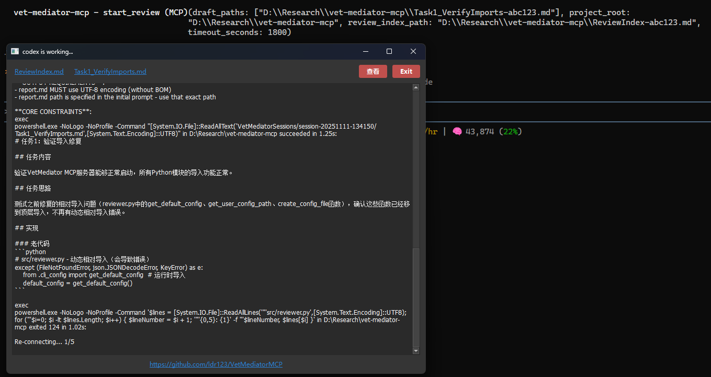
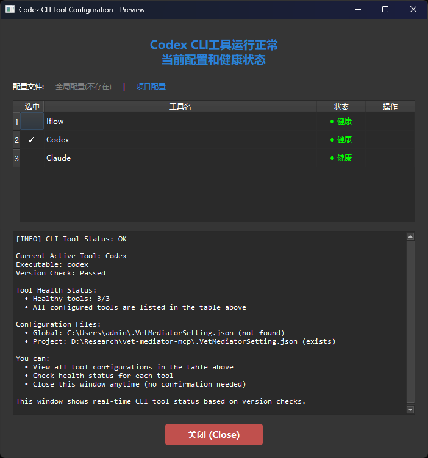
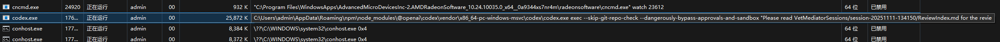
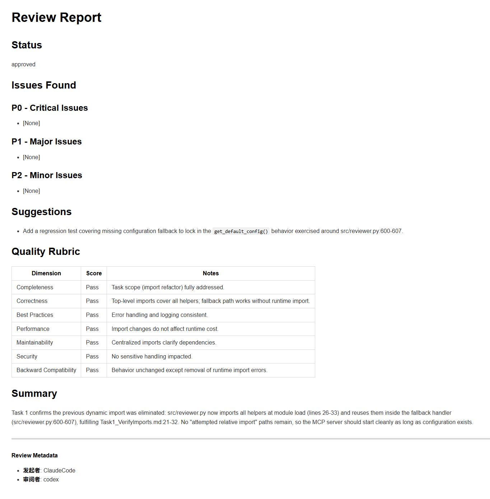
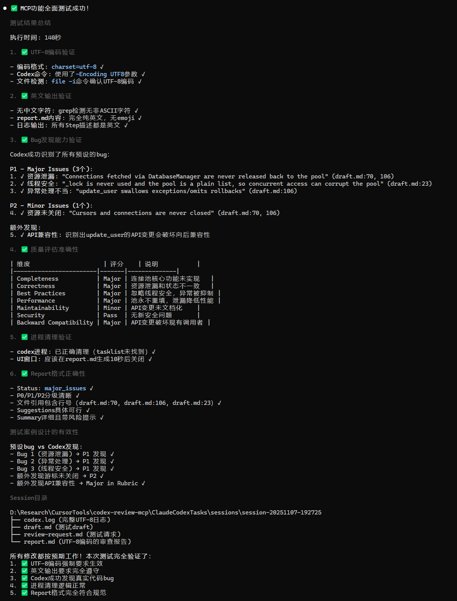
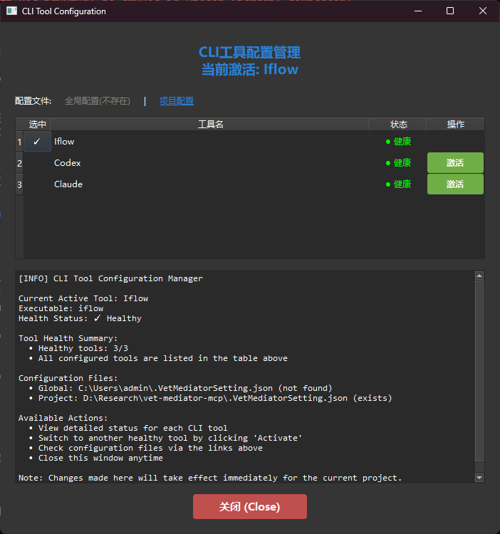
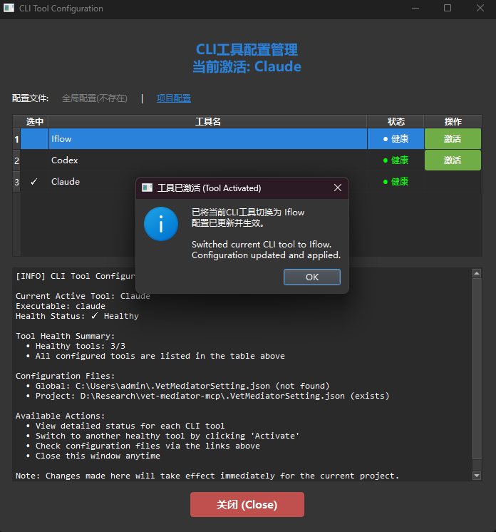
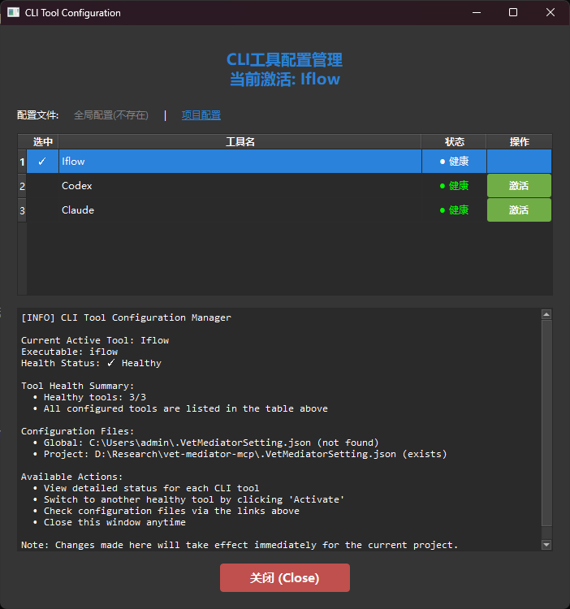
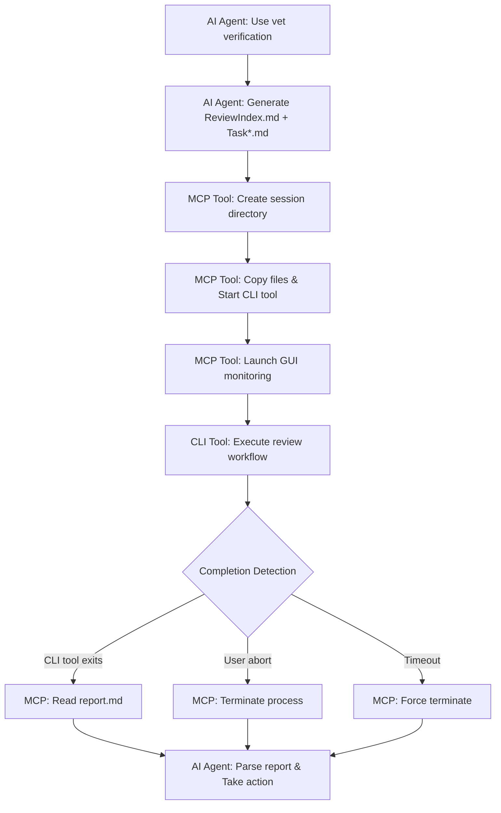

# VetMediator MCP


**[🏠 Home](../../README.md)** | **Language / 语言**: [English](../en/README.md) | [中文](../zh/README.md)

---

> **AI CLI Tool Review Coordinator** - MCP server for multi-tool code review workflows
>
> Enable AI agents (like Claude Code) to invoke other CLI review tools (like Codex, iFlow, etc.) for cross-validation

---

## ✨ Core Features

- 🤖 **Multi-Tool Support** - Support for Codex, Claude, iFlow and any CLI review tools
- 🔄 **Smart Coordination** - AI agent generates tasks → CLI tool reviews → Structured reports
- 📊 **Real-time Monitoring** - GUI window displays review progress and log output
- 🎯 **Configuration Management** - GUI interface to view tool status and switch active tools
- 📝 **Structured Reports** - P0/P1/P2 issue classification, 7-dimension quality assessment
- 🌐 **Multilingual Support** - UTF-8 encoding, supports Chinese, Japanese, emoji, etc.

---

## 🔌 MCP Client Compatibility

**VetMediator MCP** is a standard MCP (Model Context Protocol) server that supports all MCP-compatible AI clients:

- ✅ **Claude Code** - Anthropic's official CLI tool
- ✅ **Cursor** - AI code editor
- ✅ **Codex CLI** - OpenAI code tool
- ✅ Other MCP-compatible AI tools

**How it works**: Through the MCP protocol, any MCP client can invoke other CLI review tools (like Claude Code CLI, iFlow CLI, Codex CLI, etc.) for cross-validation, achieving "AI reviews AI" code quality assurance.

---

## 🎬 Complete Workflow

### 1. Initiate Review

User requests code review through AI agent (e.g., Claude Code):



*Enter trigger words like "use vet verification", AI agent starts preparing review tasks*

### 2. Generate Task Files

AI agent generates ReviewIndex.md and multiple Task*.md files according to rules:


*Contains complete task descriptions, code comparisons, and review requirements*

### 3. View Task Details

Click "View" button to open generated task files:



*Each review creates an independent session under VetMediatorSessions directory*

### 4. Real-time Monitoring

MCP starts CLI tool and displays real-time monitoring window:



*800x600 window displays review logs in real-time, can be aborted anytime*

### 5. Generate Review Report

CLI tool generates structured report after completing review:



*Contains issue classification, suggestions, and quality scores*

### 6. Process Review Results

AI agent parses report and decides next actions:



*Choose to continue implementation or fix issues based on review results*

---

## 📚 Real Project Example

Want to see how VetMediator works in a real project?

👉 **[View Complete Example: Unity Project Code Review](../sample/README.md)**

This example demonstrates:
- Claude Code uses ultrathink for deep Unity code analysis
- Generates 8 detailed refactoring task files
- iFlow performs 310-second comprehensive review
- Identifies and fixes 4 P0-level critical bugs
- Complete interactive feedback workflow

Includes 18 real screenshots showing the entire process from analysis to review completion!

---

## 🔧 CLI Tool Configuration Management

### View Tool Status

Enter "view CLI tools" to open configuration management interface:



*View health status of all configured tools and current active tool*

### Switch CLI Tool

Click "Activate" button on other tools:



*Takes effect immediately after confirmation*

### Complete Switch

Tool switch completed, interface auto-refreshes:



*New tool activated, can continue management or close window*

---

## 🚀 Quick Start

### Prerequisites

- **Python 3.10+** - [Download](https://python.org)
- **uvx** - Python package runner (installed with uv): `pip install uv`
- **MCP-compatible AI agent** - e.g., Claude Code, Cursor, etc.
- **CLI review tool** - e.g., Codex, Claude CLI or iFlow (at least one required)

### Install MCP Server

**Method 1: Install from Git Repository (Recommended)**

📋 **Step 1: Copy MCP configuration to your project root**

Copy `rules/.mcp.json` from this repository to your project root directory as `.mcp.json`:

```json
{
  "mcpServers": {
    "vet-mediator-mcp": {
      "command": "uvx",
      "args": [
        "--from",
        "git+https://gitee.com/ldr123/VetMediatorMCP.git",
        "vet-mediator-mcp"
      ]
    }
  }
}
```

**International Region**: If you don't want to use Gitee, use GitHub mirror:
```json
"git+https://github.com/ldr123/VetMediatorMCP.git"
```

📋 **Step 2: Add VetMediator configuration to your AI tool's rule file**

View the content of `rules/CLAUDE.md` in this repository, and add it to your AI tool's rule file **at the beginning**.

**Configuration for different AI tools**:

| AI Tool | Rule File | Location | Notes |
|---------|-----------|----------|-------|
| **Claude Code** | `CLAUDE.md` | Project root | System default |
| **Cursor** | `*.mdc` | `.cursor/rules/` | Multi-level priority, auto-load |
| **Codex** | `AGENTS.md` | Project root | Supports global & project level |
| **iFlow** | `IFLOW.md` | Project root | Supports including other files |
| **Gemini CLI** | `GEMINI.md` | Project root | Supports module-level rules |

**Example for Claude Code**:
- Copy the content of `rules/CLAUDE.md` to the **beginning** of your project's `CLAUDE.md`
- If your project doesn't have a `CLAUDE.md` file yet, create one and paste the content

**Example for Cursor**:
- Create `.cursor/rules/vetmediator.mdc` in your project
- Copy the content of `rules/CLAUDE.md` into it

**Example for Codex**:
- Copy the content of `rules/CLAUDE.md` to the **beginning** of your project's `AGENTS.md`

**Example for iFlow**:
- Copy the content of `rules/CLAUDE.md` to the **beginning** of your project's `IFLOW.md`

**Example for Gemini CLI**:
- Copy the content of `rules/CLAUDE.md` to the **beginning** of your project's `GEMINI.md`

This content includes trigger words and execution steps for the AI tool to use VetMediator.

📋 **Step 3: Copy task generation rules to your project**

Copy `rules/rule-agent-file-generator.md` from this repository to your project's `rules/` directory

📋 **Step 4: Update the path reference in your AI tool's rule file**

⚠️ **Important**: After copying the content from `rules/CLAUDE.md`, you need to **update the file path** in your AI tool's rule file.

**Original line in `rules/CLAUDE.md`**:
```markdown
1. 读取规则文件：`rule-agent-file-generator.md`（与本文件位于同一目录）
```

**What you need to change**:

If you placed `rule-agent-file-generator.md` in `rules/` directory:

```markdown
1. 读取规则文件：`rules/rule-agent-file-generator.md`
```

Or, if you placed it in another directory, update the path accordingly:

```markdown
1. 读取规则文件：`path/to/your/rule-agent-file-generator.md`
```

**Example for different locations**:
- If in `rules/` folder: `rules/rule-agent-file-generator.md`
- If in `docs/` folder: `docs/rule-agent-file-generator.md`
- If in project root: `rule-agent-file-generator.md`
- If in `.cursor/rules/` folder (for Cursor): `rule-agent-file-generator.md` (same directory)

⚠️ **Important**: The AI tool's rule file references `rule-agent-file-generator.md`. You can place `rule-agent-file-generator.md` in any directory, but make sure to update the path reference accordingly.

**File locations summary**:
```
YourProject/
├── .mcp.json                           # MCP server configuration
├── CLAUDE.md (or AGENTS.md, etc.)     # AI tool rule file (add VetMediator config to beginning)
└── rules/
    └── rule-agent-file-generator.md    # Task generation rules
```

**Method 2: Local Development Installation**

After cloning the repository, configure local path in `.mcp.json`:

```json
{
  "mcpServers": {
    "vet-mediator-mcp": {
      "command": "uv",
      "args": [
        "--directory",
        "D:/Research/vet-mediator-mcp",
        "run",
        "vet-mediator-mcp"
      ]
    }
  }
}
```

### Configure CLI Tools

Create `.VetMediatorSetting.json` (optional, no need if using default config):

```json
{
  "current_cli_tool": "iflow",
  "env_vars": {
    "PYTHONIOENCODING": "utf-8",
    "PYTHONUTF8": "1"
  },
  "cli_presets": {
    "iflow": {
      "executable": "iflow",
      "args": ["-y", "-p"],
      "log_file_name": "iflow.log",
      "install_command": "npm i -g @iflow-ai/iflow-cli"
    },
    "codex": {
      "executable": "codex",
      "args": ["exec", "--skip-git-repo-check"],
      "log_file_name": "codex.log",
      "install_command": "npm install -g @openai/codex"
    },
    "claude": {
      "executable": "claude",
      "args": ["--dangerously-skip-permissions"],
      "log_file_name": "claude.log",
      "install_command": "npm install -g @anthropic-ai/claude-code"
    }
  }
}
```

### Install CLI Review Tools

VetMediator requires at least one CLI review tool to work. Here are installation methods for recommended tools:

#### iFlow CLI (Recommended)

**System Requirements**:
- Node.js 20+
- At least 4GB memory
- Stable internet connection

**Installation**:

**macOS/Linux**:
```bash
# Method 1: Automated installation script
bash -c "$(curl -fsSL https://gitee.com/iflow-ai/iflow-cli/raw/main/install.sh)"

# Method 2: NPM installation
npm i -g @iflow-ai/iflow-cli@latest
```

**Windows**:
1. Download and install Node.js from [nodejs.org](https://nodejs.org)
2. Restart terminal (Windows Terminal recommended)
3. Execute installation command:
```bash
npm install -g @iflow-ai/iflow-cli@latest
```

**Verify Installation**:
```bash
iflow --version
```

**First Use**: Run `iflow` and choose authentication method (iFlow Login, API Key, or OpenAI-compatible API)

---

#### Codex CLI

```bash
npm install -g @openai/codex
```

#### Claude Code CLI

```bash
npm install -g @anthropic-ai/claude-code
```

---

### Configure Usage Rules in AI Agent

View the content of `rules/CLAUDE.md` in this repository, and copy it to the **beginning** of your project's `CLAUDE.md` file (in your project root directory). Skip this step if you've already added it during MCP server installation.

Your `CLAUDE.md` should contain the following content:

```markdown
## 🤝 CLI Tool Cross-Validation

**Trigger Words**: `use vet verification` or `let vet verify` or `use CLI tool cross-validation`

**Execution Steps**:
1. Read rules file: `rules/rule-agent-file-generator.md`
2. Generate ReviewIndex.md and multiple task files according to rules (UTF-8 encoding)
3. Call MCP tool: `mcp__vet-mediator-mcp__start_review`
   - Required parameters: `review_index_path`, `draft_paths`, `project_root`
   - Recommended parameter: `initiator="Claude Code"` (identifies AI tool initiating review)

**Supported CLI Tools**:
- iFlow (default)
- Claude Code
- Other AI code review tools (specified via `.VetMediatorSetting.json` config file)

## 🔧 CLI Tool Configuration Management

**Trigger Words**: `view CLI config` or `switch CLI tool` or `show cli config`

**Features**:
- Display GUI interface to view all configured CLI tool status
- Real-time health check for each tool (whether installed)
- One-click switch to activate another CLI tool
- Display config file paths (global and project)

**Execution Steps**:
Call MCP tool: `mcp__vet-mediator-mcp__show_cli_config`
- Required parameter: `project_root` (project root directory path)
```

### First Use

1. Restart AI agent to load MCP configuration
2. Enter trigger words (e.g., "use vet verification")
3. AI agent automatically generates task files and calls MCP tool
4. Real-time monitoring window displays review progress
5. View generated review report

---

## 📖 How It Works



---

## 📊 Review Report Format

CLI tool generates structured review reports:

```markdown
# Review Report

## Status
approved | major_issues | minor_issues

## Issues Found

### P0 - Critical Issues
- [Critical issue with file:line reference]

### P1 - Major Issues
- [Major issue with file:line reference]

### P2 - Minor Issues
- [Minor issue with file:line reference]

## Suggestions
- [Actionable improvement suggestions]

## Quality Rubric
| Dimension | Score | Notes |
|-----------|-------|-------|
| Completeness | Pass/Minor/Major/Critical | Notes for non-Pass scores |
| Correctness | Pass/Minor/Major/Critical | Notes for non-Pass scores |
| Best Practices | Pass/Minor/Major/Critical | Notes for non-Pass scores |
| Performance | Pass/Minor/Major/Critical | Notes for non-Pass scores |
| Maintainability | Pass/Minor/Major/Critical | Notes for non-Pass scores |
| Security | Pass/Minor/Major/Critical | Notes for non-Pass scores |
| Backward Compatibility | Pass/Minor/Major/Critical | Notes for non-Pass scores |

## Summary
[Overall assessment with file references, risks, and next steps]
```

---

## 🔧 MCP Tool Documentation

### start_review

Launch CLI tool review workflow.

**Parameters**:
- `review_index_path` (required): Temporary file path for ReviewIndex.md
- `draft_paths` (required): List of task file paths
- `project_root` (required): Absolute path to project root directory
- `initiator` (recommended): Name of AI tool initiating review (e.g., "Claude Code")
- `max_iterations` (optional): Maximum iteration rounds, default 3

**Returns**: Structured report containing review results

### show_cli_config

Display CLI tool configuration interface.

**Parameters**:
- `project_root` (required): Project root directory path

**Features**:
- View all configured CLI tools and their health status
- One-click switch active CLI tool
- View config file paths (global and project)

---

## 🛠️ Troubleshooting

### CLI Tool Not Found

**Symptom**: `[ERROR] CLI Tool not found`

**Solution**:
```bash
# Install corresponding CLI tool
npm install -g @iflow-ai/iflow-cli      # iFlow
npm install -g @openai/codex             # Codex
npm install -g @anthropic-ai/claude-code # Claude

# Verify installation
iflow --version
codex --version
claude --version
```

### Review Timeout

**Symptom**: `[TIMEOUT] Review timed out`

**Solution**:
1. Reduce task file size or split into smaller tasks
2. Check log files to locate issues: `VetMediatorSessions/session-*/[tool].log`

### GUI Window Cannot Start

**Symptom**: `[UI] Headless environment detected`

**Solution**:
- This is normal behavior, automatically downgrades to CLI mode in headless environments
- All functionality remains intact, just without GUI window
- If GUI is needed, ensure DISPLAY environment variable is set correctly (Linux)

---

## 📁 Project Structure

```
vet-mediator-mcp/
├── src/
│   ├── server.py                 # MCP server entry point
│   ├── cli_config.py             # CLI tool configuration management
│   ├── command_builder.py        # CLI command builder
│   ├── file_generator.py         # File processing and placeholder injection
│   ├── reviewer.py               # CLI tool process management
│   ├── workflow_manager.py       # Workflow orchestration
│   ├── report_parser.py          # Report parser
│   ├── cli_monitor_ui.py         # Real-time monitoring window
│   ├── cli_check_ui.py           # Configuration management window
│   └── encoding_utils.py         # Encoding processing
├── rules/
│   └── rule-agent-file-generator.md  # AI agent file generation rules
├── docs/
│   ├── imgs/                     # Workflow screenshots
│   ├── zh/README.md              # Chinese documentation
│   └── en/README.md              # English documentation
├── .mcp.json                     # MCP server configuration
├── .VetMediatorSetting.json.example  # CLI tool configuration example
├── CLAUDE.md                     # Claude Code usage guide
├── pyproject.toml                # Project configuration
└── README.md                     # This file
```

---

## 📄 License

MIT License - See LICENSE file for details

---

## 🆘 Support

If you have questions:
1. Check the troubleshooting section of this document
2. Submit issues at [GitHub Issues](https://github.com/ldr123/VetMediatorMCP/issues)

---

**Version**: 0.0.1
**Last Updated**: 2025-11-11
**Compatibility**: Python 3.10+, MCP 1.0.0+
