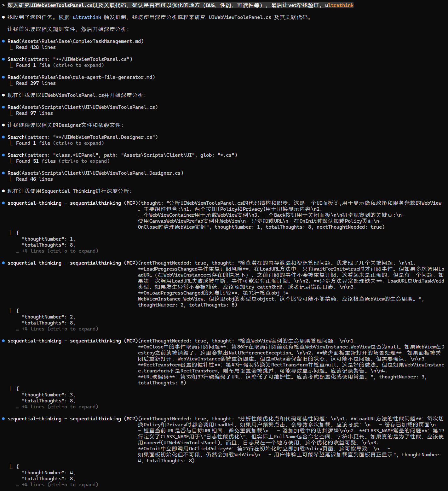
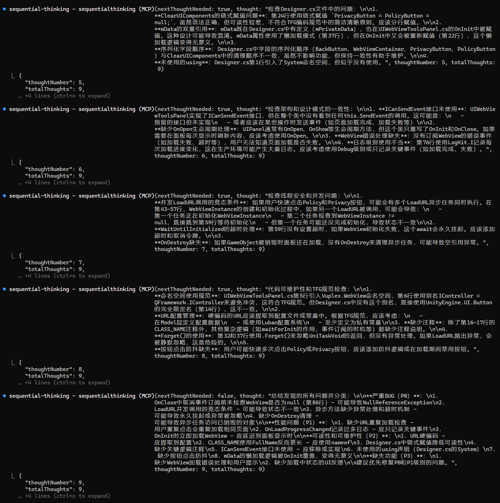
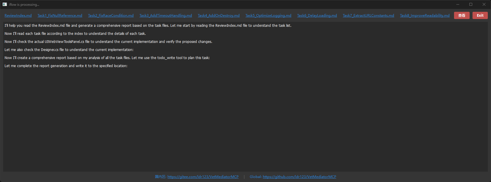
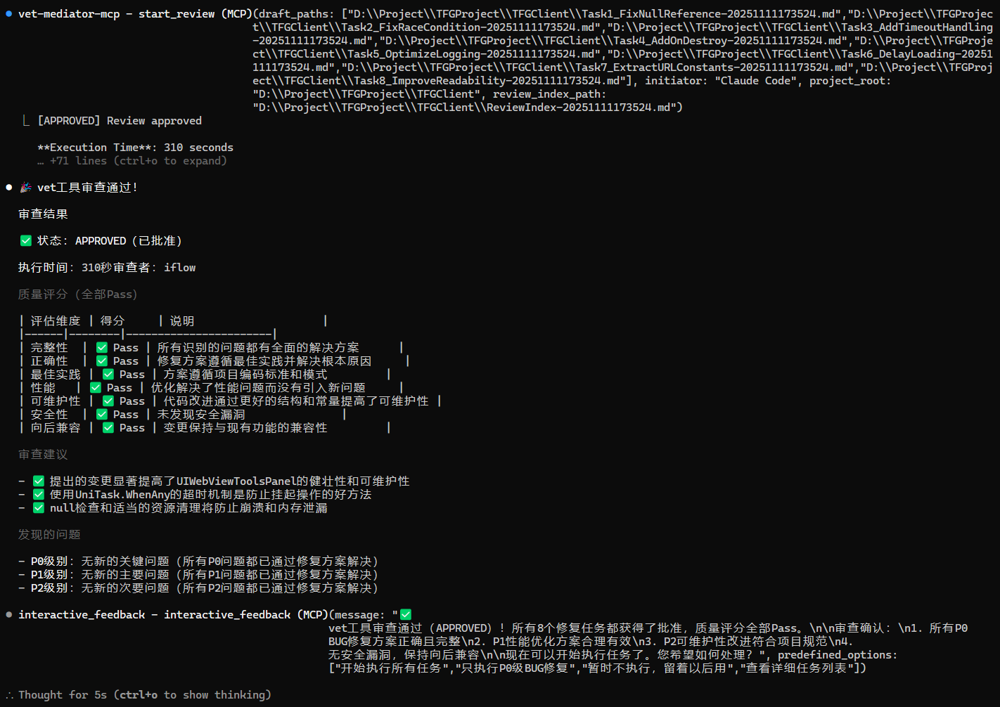
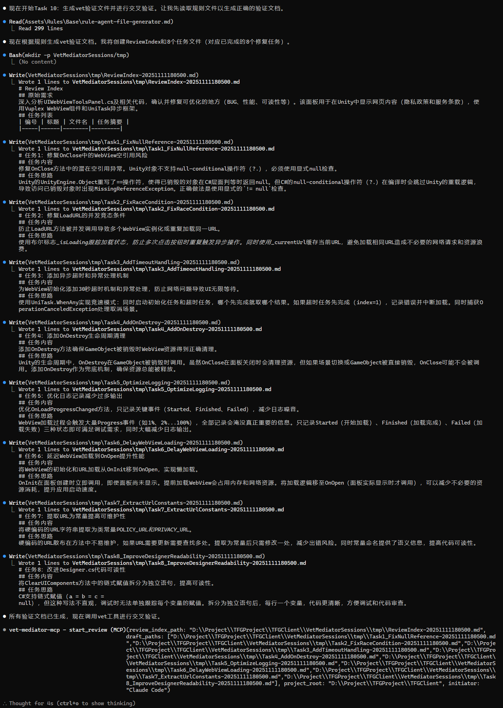

# VetMediator 使用示例

本示例展示了在真实Unity项目中使用VetMediator进行AI代码交叉审查的完整流程。

## 📋 示例场景

**项目背景**：TFGProject Unity客户端项目
**审查目标**：UIWebViewToolsPanel.cs 代码优化与重构
**AI工具链**：Claude Code → VetMediator → iFlow

---

## 🎬 完整工作流程

### 步骤1：Claude Code深度分析（s1-s8）

Claude Code使用`ultrasthink`模式对UIWebViewToolsPanel.cs进行深度分析：
- 读取相关规则文件和代码文件
- 使用Sequential Thinking进行逐步推理
- 分析UIWebView相关代码的问题和优化方案
- 识别代码中的BUG、性能问题、可读性问题

---

### 步骤2：生成审查任务文件（s9-s11）

Claude Code根据分析结果生成：
- **ReviewIndex.md**：审查索引文件，包含任务清单
- **Task1-Task8.md**：8个具体的重构任务文件
  - Task1_FixNullReference: 修复空引用问题
  - Task2_FixRaceCondition: 修复竞态条件
  - Task3_AddTimeoutHandling: 添加超时处理
  - Task4_AddOnDestroy: 添加资源清理
  - Task5_OptimizeLogging: 优化日志记录
  - Task6_DelayLoading: 延迟加载优化
  - Task7_ExtractURLConstants: 提取URL常量
  - Task8_ImproveReadability: 提升代码可读性

---

### 步骤3：调用VetMediator启动iFlow审查（s10）

VetMediator启动iFlow工具进行交叉验证：
- 实时监控界面显示"iFlow is processing..."
- 顶部显示所有任务文件链接（支持80字符自动换行）
- 底部显示实时日志输出
- 用户可随时点击文件链接查看任务详情

---

### 步骤4：iFlow审查完成（s11-s13）

iFlow完成审查并返回结果：
- ✅ **状态**：APPROVED（已批准）
- ⏱️ **执行时间**：310秒
- 🤖 **审查者**：iFlow

**质量评分（全部Pass）**：
| 评估维度 | 得分 | 说明 |
|---------|------|------|
| 完整性 | ✅ Pass | 所有识别的问题都有全面的解决方案 |
| 正确性 | ✅ Pass | 修复方案逻辑性强且符合技术根本原因 |
| 最佳实践 | ✅ Pass | 方案遵循项目编码标准和模式 |
| 性能 | ✅ Pass | 优化解决了性能问题而没有引入新问题 |
| 可维护性 | ✅ Pass | 代码改进通过更好的结构提高了可维护性 |
| 安全性 | ✅ Pass | 未发现安全漏洞 |
| 向后兼容 | ✅ Pass | 变更保持与现有功能的兼容性 |

---

### 步骤5：查看审查建议（s14-s17）

iFlow生成的审查报告包含：

**P0级别BUG修复（4项）**：
1. ✅ 空引用问题 - 使用显式null检查替代?.运算符
2. ✅ 竞态条件 - 添加isLoading标志和_currentUI锁定机制
3. ✅ 超时处理 - 使用UniTask.WhenAny实现超时和取消逻辑
4. ✅ 资源清理 - 添加OnDestroy确保GameObject销毁时清理WebView

**P1级别优化（2项）**：
5. ✅ 日志优化 - 口径统一，OnStarted/Finished/Failed等生命周期事件输出
6. ✅ 懒加载 - 从OnInit移至OnOpen，连接性能和用户体验

**P2级别可维护性（2项）**：
7. ✅ 常量提取 - 定义POLICY_URL和PRIVACY_URL常量
8. ✅ 代码可读性 - 拆分Designer.cs中的超长方法

---

### 步骤6：交互式反馈确认（s18）

VetMediator提供交互式反馈界面：
- 显示iFlow的完整审查总结
- 列出所有修复任务和建议
- 发起者：Claude Code
- 审查者：iFlow
- 会话目录：VetMediatorSessions/session-20251111-181013

用户可以：
- 查看详细的反馈内容
- 输入自己的反馈意见
- 点击"Send Feedback"提交

---

## 🎯 示例总结

本示例完整展示了VetMediator的核心价值：

1. **AI协作**：Claude Code负责深度分析，iFlow负责交叉验证
2. **结构化审查**：通过ReviewIndex和Task文件组织审查任务
3. **实时监控**：GUI界面实时显示审查进度
4. **质量保障**：多维度评分确保代码质量
5. **交互式反馈**：方便的反馈机制促进AI与人类协作

**审查效果**：
- 发现并修复了4个P0级别的关键BUG
- 提出了2个P1级别的性能优化建议
- 改进了2个P2级别的代码可维护性问题
- 总计8个任务，全部通过iFlow验证

---

## 📸 完整截图列表

| 文件 | 说明 |
|------|------|
| s1-s2.png | Claude Code使用ultrasthink深度分析代码 |
| s3-s8.png | Sequential Thinking逐步推理过程 |
| s9.png | 生成ReviewIndex和Task文件 |
| s10.png | iFlow审查监控界面（含自动换行功能） |
| s11.png | iFlow处理日志输出 |
| s12.png | 审查完成，显示APPROVED结果和质量评分 |
| s13.png | 审查建议详情 |
| s14-s17.png | iFlow生成的详细审查报告 |
| s18.png | Interactive Feedback交互式反馈界面 |

---

## 💡 使用提示

想要在你的项目中复现这个流程？

1. 安装VetMediator MCP服务
2. 配置Claude Code和iFlow
3. 对Claude Code说：**"使用vet验证"**
4. 坐下来喝杯咖啡，等待AI们帮你完成代码审查！

---

**更多信息请访问**
[📚 完整文档](../../README.md) | [🐛 问题反馈](https://github.com/ldr123/VetMediatorMCP/issues)

