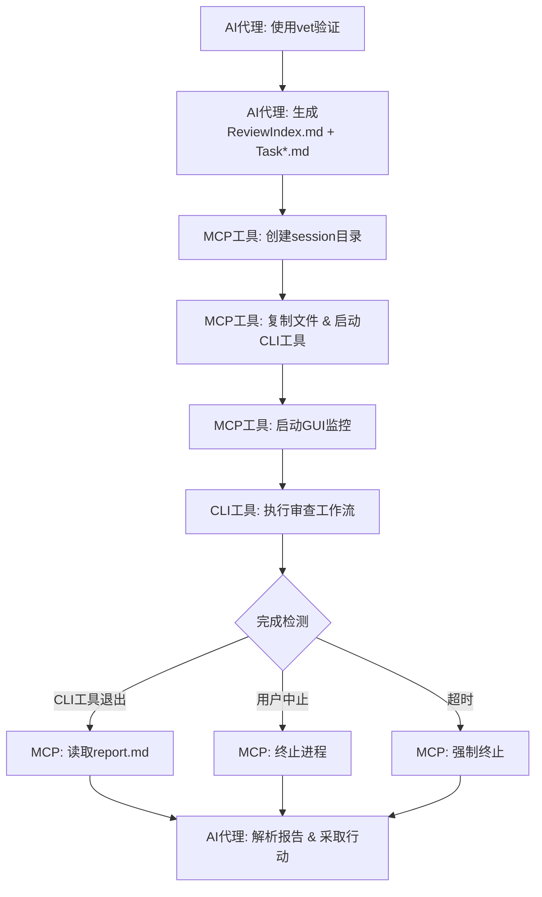

# VetMediator MCP


**[🏠 首页](../../README.md)** | **Language / 语言**: [English](../en/README.md) | [中文](../zh/README.md)

---

> **AI CLI工具审查协调器** - 支持多工具代码审查工作流的MCP服务器
>
> 让AI代理（如Claude Code）调用其他CLI审查工具（如Codex、iFlow等）进行代码交叉验证

---

## ✨ 核心特性

- 🤖 **多工具支持** - 支持Codex、Claude、iFlow等任意CLI审查工具
- 🔄 **智能协调** - AI代理生成任务→CLI工具审查→结构化报告
- 📊 **实时监控** - GUI窗口显示审查进度和日志输出
- 🎯 **配置管理** - GUI界面查看工具状态、一键切换激活工具
- 📝 **结构化报告** - P0/P1/P2问题分级，7维度质量评估
- 🌐 **多语言支持** - UTF-8编码，支持中文、日文、emoji等
- 💾 **智能缓存** - Hash验证自动缓存规则文件，节省Token消耗
- 🔧 **自动迁移** - 全局配置自动迁移到 `~/.vetmediator/` 目录

---

## 🔌 MCP客户端兼容性

**VetMediator MCP** 是一个标准的MCP（Model Context Protocol）服务器，支持所有兼容MCP协议的AI客户端：

- ✅ **Claude Code** - Anthropic官方CLI工具
- ✅ **Cursor** - AI代码编辑器
- ✅ **Codex CLI** - OpenAI代码工具
- ✅ 其他支持MCP协议的AI工具

**工作原理**：通过MCP协议，任意MCP客户端都可以调用其他CLI审查工具（如Claude Code CLI、iFlow CLI、Codex CLI等）进行交叉验证，实现"AI审查AI"的代码质量保障。

---

## 🎬 完整工作流程

### 1. 发起审查

用户通过AI代理（如Claude Code）请求代码审查：


*输入触发词如"使用vet验证"，AI代理开始准备审查任务*

### 2. 生成任务文件

AI代理根据规则生成ReviewIndex.md和多个Task*.md文件：


*包含完整的任务描述、代码对比和审查要求*

### 3. 查看任务详情

点击"查看"按钮可以打开生成的任务文件：


*每次审查在VetMediatorSessions目录下创建独立会话*

### 4. 实时监控审查

MCP启动CLI工具并显示实时监控窗口：


*800x600窗口实时显示审查日志，可随时中止*

### 5. 生成审查报告

CLI工具完成审查后生成结构化报告：


*包含问题分级、建议和质量评分*

### 6. 处理审查结果

AI代理解析报告并决定后续动作：


*根据审查结果选择继续实现或修复问题*

---

## 📚 真实项目示例

想看看VetMediator在真实项目中的应用效果？

👉 **[查看完整示例：Unity项目代码审查](../sample/README.md)**

这个示例展示了：
- Claude Code使用ultrathink深度分析Unity代码
- 生成8个详细的重构任务文件
- iFlow进行310秒的全面审查
- 发现并修复4个P0级别关键BUG
- 完整的交互式反馈流程

包含18张真实截图，完整展示从分析到审查完成的全过程！

---

## 🔧 CLI工具配置管理

### 查看工具状态

输入"查看CLI工具"打开配置管理界面：


*查看所有配置工具的健康状态和当前激活工具*

### 切换CLI工具

点击其他工具的"激活"按钮：


*确认后立即生效*

### 完成切换

工具切换完成，界面自动刷新：


*新工具已激活，可以继续管理或关闭窗口*

---

## 🚀 快速开始

### 前置要求

- **Python 3.10+** - [下载](https://python.org)
- **uvx** - Python包运行器（随uv一起安装）：`pip install uv`
- **MCP兼容的AI代理** - 如Claude Code、Cursor等
- **CLI审查工具** - 如iFlow、Codex或Claude CLI（至少安装一个）

### 一键安装（推荐）

👉 **[3分钟快速开始指南](../QUICKSTART.md)**

使用自动化安装脚本完成所有配置：

```bash
curl -sSL https://raw.githubusercontent.com/ldr123/VetMediatorMCP/master/install.sh | bash
```

**脚本自动完成**：
- ✅ 依赖检查（Python 3.10+、uvx）
- ✅ 生成 `.mcp.json` 配置文件
- ✅ 检测已安装的CLI工具
- ✅ 注入使用规则到 `CLAUDE.md`
- ✅ 创建 `VetMediatorSessions/` 目录

**验证安装**：
```bash
./verify-config.sh
```

### 手动安装（开发者）

克隆仓库后，在 `.mcp.json` 中配置本地路径：

```json
{
  "mcpServers": {
    "vet-mediator-mcp": {
      "command": "uv",
      "args": [
        "--directory",
        "/path/to/VetMediatorMCP",
        "run",
        "vet-mediator-mcp"
      ]
    }
  }
}
```

### 首次使用

1. 重启AI工具（Claude Code / Cursor等）以加载MCP配置
2. 输入触发词：`使用vet验证` 或 `use vet validation`
3. AI工具自动生成任务文件并调用MCP工具
4. 实时监控窗口显示审查进度
5. 查看生成的审查报告

---

## 📖 工作原理



---

## 📊 审查报告格式

CLI工具生成结构化的审查报告：

```markdown
# Review Report

## Status
approved | major_issues | minor_issues

## Issues Found

### P0 - Critical Issues
- [关键问题，带文件:行号引用]

### P1 - Major Issues
- [重要问题，带文件:行号引用]

### P2 - Minor Issues
- [次要问题，带文件:行号引用]

## Suggestions
- [可执行的改进建议]

## Quality Rubric
| Dimension | Score | Notes |
|-----------|-------|-------|
| Completeness | Pass/Minor/Major/Critical | 非Pass时的说明 |
| Correctness | Pass/Minor/Major/Critical | 非Pass时的说明 |
| Best Practices | Pass/Minor/Major/Critical | 非Pass时的说明 |
| Performance | Pass/Minor/Major/Critical | 非Pass时的说明 |
| Maintainability | Pass/Minor/Major/Critical | 非Pass时的说明 |
| Security | Pass/Minor/Major/Critical | 非Pass时的说明 |
| Backward Compatibility | Pass/Minor/Major/Critical | 非Pass时的说明 |

## Summary
[整体评估，含文件引用、风险和后续步骤]
```

---

## 🔧 MCP工具说明

### start_review

启动CLI工具审查工作流。

**参数**：
- `review_index_path` (必需): ReviewIndex.md的临时文件路径
- `draft_paths` (必需): 任务文件路径列表
- `project_root` (必需): 项目根目录绝对路径
- `initiator` (推荐): 发起审查的AI工具名称（如"Claude Code"）
- `max_iterations` (可选): 最大迭代轮次，默认3

**返回**：包含审查结果的结构化报告

### show_cli_config

显示CLI工具配置界面。

**参数**：
- `project_root` (必需): 项目根目录路径

**功能**：
- 查看所有配置的CLI工具及其健康状态
- 一键切换当前激活的CLI工具
- 查看配置文件路径（全局和项目）

### get_review_rule_hash

获取审查规则文件的SHA-256 hash值（前12位），用于本地缓存版本检测。

**参数**：
- `rule_type` (可选): 规则类型，默认 "file-generator"

**返回**：
```json
{
  "rule_type": "file-generator",
  "hash": "a1b2c3d4e5f6",
  "description": "Rule file hash for cache validation"
}
```

**用途**：
- AI代理可以通过hash判断本地缓存的规则文件是否是最新版本
- 避免每次都重新下载规则文件，节省Token消耗

### update_review_rules

更新审查规则文件到指定目录。

**参数**：
- `dst_path` (必需): 完整目标路径（如 `/path/to/project/VetMediatorSessions`）
- `rule_type` (可选): 规则类型，默认 "file-generator"

**功能**：
- MCP服务器会自动删除旧的规则缓存文件
- 写入最新版本的规则文件到指定目录
- 规则文档包含：文件格式规范、模板、示例、MCP调用说明等

**返回**：
```json
{
  "status": "success",
  "rule_file_path": "/path/to/project/VetMediatorSessions/vet_mediator_rule_a1b2c3d4e5f6.md",
  "hash": "a1b2c3d4e5f6",
  "message": "规则文件已更新"
}
```

---

## 🔧 高级配置

### 两阶段审查模式

VetMediator 支持两阶段审查：**第一阶段**审查任务规划，**第二阶段**审查代码实现。

**启用方法**：

在调用 `start_review` 时提供 `original_requirement_path` 和 `task_planning_path` 参数：

```python
mcp__vet-mediator-mcp__start_review(
    review_index_path="...",
    draft_paths=["..."],
    project_root="...",
    original_requirement_path="/path/to/OriginalRequirement.md",  # 原始需求
    task_planning_path="/path/to/TaskPlanning.md"                  # 任务规划
)
```

**工作流程**：
1. CLI工具先审查任务规划是否合理（与原始需求对比）
2. 如果规划通过，再审查具体的代码实现
3. 两次审查结果都会包含在最终报告中

**适用场景**：
- 复杂功能开发，需要先规划后实现
- 团队协作，需要先审查设计再审查代码
- 高质量要求，双重保障代码质量

### 自定义CLI工具配置

默认情况下，VetMediator 会自动检测已安装的CLI工具。你也可以手动配置：

**项目级配置**（优先级高）：

在项目根目录创建 `.VetMediatorSetting.json`：

```json
{
  "tools": [
    {
      "name": "iflow",
      "executable": "iflow",
      "enabled": true
    },
    {
      "name": "codex",
      "executable": "codex",
      "args": ["--custom-arg"],
      "enabled": false
    }
  ],
  "active_tool": "iflow"
}
```

**全局配置**（低优先级）：

配置文件位置：`~/.vetmediator/config.json`

格式同项目级配置。

### 性能优化建议

**1. 规则文件缓存**

规则文件会自动缓存到 `VetMediatorSessions/` 目录：
- 文件名格式：`vet_mediator_rule_{hash}.md`
- 每次审查前会自动检查hash，只在版本变化时重新下载
- 建议将 `VetMediatorSessions/vet_mediator_rule_*.md` 加入版本控制（可选）

**2. 任务文件大小控制**

为了获得最佳性能：
- 单个任务文件建议不超过 1000 行代码
- 复杂功能建议拆分为多个任务文件
- 使用 `draft_paths` 参数按顺序提交多个任务

**3. 并发审查限制**

- 默认情况下，VetMediator 一次只处理一个审查任务
- 如需并发，可以在不同项目目录中启动多个审查
- 注意CLI工具的API调用限制

---

## 🛠️ 故障排除

### CLI工具未找到

**症状**：`[ERROR] CLI Tool not found`

**解决方案**：
```bash
# 安装对应的CLI工具
npm install -g @iflow-ai/iflow-cli      # iFlow
npm install -g @openai/codex             # Codex
npm install -g @anthropic-ai/claude-code # Claude

# 验证安装
iflow --version
codex --version
claude --version
```

### 审查超时

**症状**：`[TIMEOUT] Review timed out`

**解决方案**：
1. 减少任务文件大小或拆分为更小的任务
2. 查看日志文件定位问题：`VetMediatorSessions/session-*/[tool].log`

### GUI窗口无法启动

**症状**：`[UI] Headless environment detected`

**解决方案**：
- 这是正常行为，在无GUI环境下自动降级到CLI模式
- 所有功能保持不变，只是没有GUI窗口
- 如需GUI，确保DISPLAY环境变量设置正确（Linux）

### 规则文件下载失败

**症状**：`[ERROR] Failed to download rule file`

**解决方案**：
```bash
# 1. 检查网络连接
curl -I https://raw.githubusercontent.com/ldr123/VetMediatorMCP/master/rules/CLAUDE.md

# 2. 手动下载规则文件
cd VetMediatorSessions
wget https://raw.githubusercontent.com/ldr123/VetMediatorMCP/master/rules/rule-agent-file-generator.md
# 重命名为 vet_mediator_rule_{hash}.md

# 3. 中国用户使用Gitee镜像
# curl -O https://gitee.com/ldr123/VetMediatorMCP/raw/master/rules/rule-agent-file-generator.md
```

### VetMediatorSessions 目录权限问题

**症状**：`[ERROR] Permission denied: VetMediatorSessions/`

**解决方案**：
```bash
# 检查目录权限
ls -la VetMediatorSessions/

# 修复权限（Linux/macOS）
chmod 755 VetMediatorSessions/
chmod 644 VetMediatorSessions/*

# Windows（Git Bash）
# 右键点击目录 -> 属性 -> 安全 -> 编辑权限
```

### MCP工具调用失败

**症状**：`Tool 'vet-mediator-mcp' not found`

**解决方案**：
1. 检查 `.mcp.json` 配置是否正确
2. 重启AI工具（Claude Code / Cursor）
3. 运行验证脚本：`./verify-config.sh`
4. 检查 uvx 是否正确安装：`uvx --version`

### Python 版本过低

**症状**：`Python 3.10+ required, but found Python 3.9`

**解决方案**：
```bash
# macOS (使用Homebrew)
brew install python@3.10

# Ubuntu/Debian
sudo apt update
sudo apt install python3.10

# Windows
# 从 https://python.org 下载并安装 Python 3.10+

# 验证安装
python3 --version
```

### 审查报告格式错误

**症状**：CLI工具生成的报告无法解析

**解决方案**：
1. 检查CLI工具版本是否最新：`iflow --version`
2. 查看原始报告文件：`VetMediatorSessions/session-*/Report.md`
3. 确认CLI工具配置正确（API密钥等）
4. 尝试切换到其他CLI工具

### 诊断命令集合

**收集诊断信息**：
```bash
# 运行日志收集脚本
./collect-logs.sh

# 或手动收集
echo "=== 系统信息 ===" > debug.log
uname -a >> debug.log
python3 --version >> debug.log
uvx --version >> debug.log

echo "=== 配置文件 ===" >> debug.log
cat .mcp.json >> debug.log

echo "=== CLI工具 ===" >> debug.log
iflow --version >> debug.log 2>&1 || echo "iFlow: not installed" >> debug.log
codex --version >> debug.log 2>&1 || echo "Codex: not installed" >> debug.log

echo "=== 最近错误 ===" >> debug.log
grep -r "ERROR" VetMediatorSessions/ | tail -n 20 >> debug.log

# 将 debug.log 附加到 GitHub Issue
```

**快速诊断**：
```bash
# 运行验证脚本
./verify-config.sh

# 检查具体项目
python3 -c "import sys; print(f'Python {sys.version}')"
uvx --version
ls -la .mcp.json
ls -la VetMediatorSessions/
```

---

## 📁 项目结构

```
vet-mediator-mcp/
├── src/
│   ├── server.py                 # MCP服务器入口
│   ├── cli_config.py             # CLI工具配置管理
│   ├── command_builder.py        # CLI命令构建
│   ├── file_generator.py         # 文件处理和占位符注入
│   ├── reviewer.py               # CLI工具进程管理
│   ├── workflow_manager.py       # 工作流编排
│   ├── report_parser.py          # 报告解析
│   ├── cli_monitor_ui.py         # 实时监控窗口
│   ├── cli_check_ui.py           # 配置管理窗口
│   └── encoding_utils.py         # 编码处理
├── rules/
│   └── rule-agent-file-generator.md  # AI代理文件生成规则
├── ../imgs/                         # 工作流程截图
├── .mcp.json                     # MCP服务器配置
├── .VetMediatorSetting.json.example  # CLI工具配置示例
├── CLAUDE.md                     # Claude Code使用指南
├── pyproject.toml                # 项目配置
└── README.md                     # 本文件
```

---

## 📄 许可证

MIT License - 详见LICENSE文件

---

## 🆘 支持

如有问题：
1. 查看本文档的故障排除部分
2. 在[GitHub Issues](https://github.com/ldr123/VetMediatorMCP/issues)提交问题

---

**版本**：2.1.0
**最后更新**：2025-11-13
**兼容性**：Python 3.10+, MCP 1.0.0+
