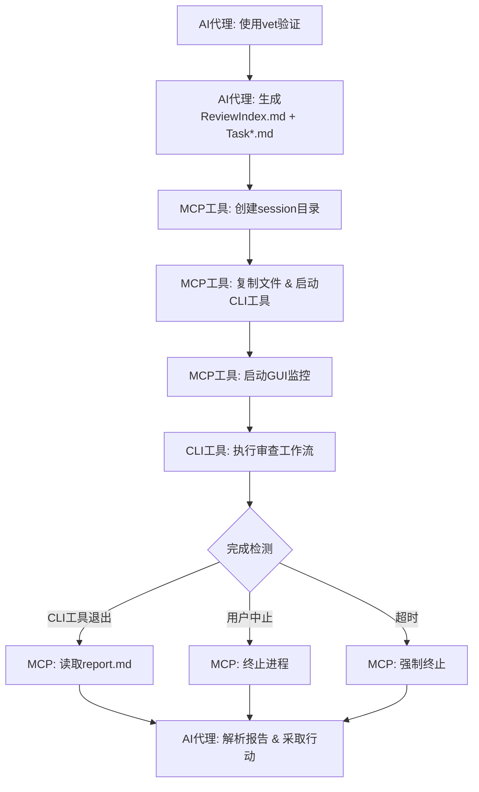

# VetMediator MCP


**[🏠 首页](../../README.md)** | **Language / 语言**: [English](../en/README.md) | [中文](../zh/README.md)

---

> **AI CLI工具审查协调器** - 支持多工具代码审查工作流的MCP服务器
>
> 让AI代理（如Claude Code）调用其他CLI审查工具（如Codex、iFlow等）进行代码交叉验证

---

## ✨ 核心特性

- 🤖 **多工具支持** - 支持Codex、Claude、iFlow等任意CLI审查工具
- 🔄 **智能协调** - AI代理生成任务→CLI工具审查→结构化报告
- 📊 **实时监控** - GUI窗口显示审查进度和日志输出
- 🎯 **配置管理** - GUI界面查看工具状态、一键切换激活工具
- 📝 **结构化报告** - P0/P1/P2问题分级，7维度质量评估
- 🌐 **多语言支持** - UTF-8编码，支持中文、日文、emoji等
- 💾 **智能缓存** - Hash验证自动缓存规则文件，节省Token消耗
- 🔧 **自动迁移** - 全局配置自动迁移到 `~/.vetmediator/` 目录

---

## 🔌 MCP客户端兼容性

**VetMediator MCP** 是一个标准的MCP（Model Context Protocol）服务器，支持所有兼容MCP协议的AI客户端：

- ✅ **Claude Code** - Anthropic官方CLI工具
- ✅ **Cursor** - AI代码编辑器
- ✅ **Codex CLI** - OpenAI代码工具
- ✅ 其他支持MCP协议的AI工具

**工作原理**：通过MCP协议，任意MCP客户端都可以调用其他CLI审查工具（如Claude Code CLI、iFlow CLI、Codex CLI等）进行交叉验证，实现"AI审查AI"的代码质量保障。

---

## 🎬 完整工作流程

### 1. 发起审查

用户通过AI代理（如Claude Code）请求代码审查：


*输入触发词如"使用vet验证"，AI代理开始准备审查任务*

### 2. 生成任务文件

AI代理根据规则生成ReviewIndex.md和多个Task*.md文件：


*包含完整的任务描述、代码对比和审查要求*

### 3. 查看任务详情

点击"查看"按钮可以打开生成的任务文件：


*每次审查在VetMediatorSessions目录下创建独立会话*

### 4. 实时监控审查

MCP启动CLI工具并显示实时监控窗口：


*800x600窗口实时显示审查日志，可随时中止*

### 5. 生成审查报告

CLI工具完成审查后生成结构化报告：


*包含问题分级、建议和质量评分*

### 6. 处理审查结果

AI代理解析报告并决定后续动作：


*根据审查结果选择继续实现或修复问题*

---

## 📚 真实项目示例

想看看VetMediator在真实项目中的应用效果？

👉 **[查看完整示例：Unity项目代码审查](../sample/README.md)**

这个示例展示了：
- Claude Code使用ultrathink深度分析Unity代码
- 生成8个详细的重构任务文件
- iFlow进行310秒的全面审查
- 发现并修复4个P0级别关键BUG
- 完整的交互式反馈流程

包含18张真实截图，完整展示从分析到审查完成的全过程！

---

## 🔧 CLI工具配置管理

### 查看工具状态

输入"查看CLI工具"打开配置管理界面：


*查看所有配置工具的健康状态和当前激活工具*

### 切换CLI工具

点击其他工具的"激活"按钮：


*确认后立即生效*

### 完成切换

工具切换完成，界面自动刷新：


*新工具已激活，可以继续管理或关闭窗口*

---

## 🚀 快速开始

### 前置要求

- **Python 3.10+** - [下载](https://python.org)
- **uvx** - Python包运行器（随uv一起安装）：`pip install uv`
- **MCP兼容的AI代理** - 如Claude Code、Cursor等
- **CLI审查工具** - 如Codex、Claude CLI或iFlow（至少安装一个）

### 安装MCP服务器

**方式一：从Git仓库安装（推荐）**

📋 **步骤1：复制MCP配置到项目根目录**

从本仓库复制 `rules/.mcp.json` 到你的项目根目录并命名为 `.mcp.json`：

```json
{
  "mcpServers": {
    "vet-mediator-mcp": {
      "command": "uvx",
      "args": [
        "--from",
        "git+https://gitee.com/ldr123/VetMediatorMCP.git",
        "vet-mediator-mcp"
      ]
    }
  }
}
```

**国际区**：如果不想使用gitee可以使用GitHub镜像：
```json
"git+https://github.com/ldr123/VetMediatorMCP.git"
```

📋 **步骤2：添加VetMediator配置到AI工具的规则文件**

查看本仓库的 `rules/CLAUDE.md` 文件内容，并将其添加到你的AI工具规则文件的**开头部分**。

**不同AI工具的配置方式**:

| AI工具 | 规则文件 | 位置 | 说明 |
|--------|---------|------|------|
| **Claude Code** | `CLAUDE.md` | 项目根目录 | 系统预设 |
| **Cursor** | `*.mdc` | `.cursor/rules/` | 多级优先级，自动加载 |
| **Codex** | `AGENTS.md` | 项目根目录 | 支持全局与项目级 |
| **iFlow** | `IFLOW.md` | 项目根目录 | 支持包含其他文件 |
| **Gemini CLI** | `GEMINI.md` | 项目根目录 | 支持模块级规则 |

**Claude Code配置示例**:
- 将 `rules/CLAUDE.md` 的内容复制到项目根目录的 `CLAUDE.md` **开头部分**
- 如果项目还没有 `CLAUDE.md` 文件，创建一个并粘贴内容

**Cursor配置示例**:
- 在项目中创建 `.cursor/rules/vetmediator.mdc`
- 将 `rules/CLAUDE.md` 的内容复制进去

**Codex配置示例**:
- 将 `rules/CLAUDE.md` 的内容复制到项目根目录的 `AGENTS.md` **开头部分**

**iFlow配置示例**:
- 将 `rules/CLAUDE.md` 的内容复制到项目根目录的 `IFLOW.md` **开头部分**

**Gemini CLI配置示例**:
- 将 `rules/CLAUDE.md` 的内容复制到项目根目录的 `GEMINI.md` **开头部分**

**规则内容说明**：AI工具首次使用时会通过MCP自动下载并缓存完整的审查规则（约4000 tokens），后续使用直接读取本地缓存，大幅节省Token消耗。

**文件位置总结**:
```
YourProject/
├── .mcp.json                           # MCP服务器配置
└── CLAUDE.md (或 AGENTS.md 等)        # AI工具规则文件（将VetMediator配置添加到开头）
```

**方式二：本地开发安装**

克隆仓库后，在`.mcp.json`中配置本地路径：

```json
{
  "mcpServers": {
    "vet-mediator-mcp": {
      "command": "uv",
      "args": [
        "--directory",
        "D:/Research/vet-mediator-mcp",
        "run",
        "vet-mediator-mcp"
      ]
    }
  }
}
```

### 配置CLI工具

创建`.VetMediatorSetting.json`（可选，使用默认配置无需此文件）：

```json
{
  "current_cli_tool": "iflow",
  "env_vars": {
    "PYTHONIOENCODING": "utf-8",
    "PYTHONUTF8": "1"
  },
  "cli_presets": {
    "iflow": {
      "executable": "iflow",
      "args": ["-y", "-p"],
      "log_file_name": "iflow.log",
      "install_command": "npm i -g @iflow-ai/iflow-cli"
    },
    "codex": {
      "executable": "codex",
      "args": ["exec", "--skip-git-repo-check"],
      "log_file_name": "codex.log",
      "install_command": "npm install -g @openai/codex"
    },
    "claude": {
      "executable": "claude",
      "args": ["--dangerously-skip-permissions"],
      "log_file_name": "claude.log",
      "install_command": "npm install -g @anthropic-ai/claude-code"
    }
  }
}
```

### 安装CLI审查工具

VetMediator需要至少一个CLI审查工具才能工作。以下是推荐工具的安装方法：

#### iFlow CLI（推荐）

**系统要求**：
- Node.js 20+
- 至少4GB内存
- 稳定的网络连接

**安装方法**：

**macOS/Linux**：
```bash
# 方式1：自动安装脚本
bash -c "$(curl -fsSL https://gitee.com/iflow-ai/iflow-cli/raw/main/install.sh)"

# 方式2：NPM安装
npm i -g @iflow-ai/iflow-cli@latest
```

**Windows**：
1. 从 [nodejs.org](https://nodejs.org) 下载并安装Node.js
2. 重启终端（推荐使用Windows Terminal）
3. 执行安装命令：
```bash
npm install -g @iflow-ai/iflow-cli@latest
```

**验证安装**：
```bash
iflow --version
```

**首次使用**：运行 `iflow` 选择认证方式（iFlow登录、API Key或OpenAI兼容API）

---

#### Codex CLI

```bash
npm install -g @openai/codex
```

#### Claude Code CLI

```bash
npm install -g @anthropic-ai/claude-code
```

---

### 在AI代理中配置使用规则

查看本仓库的 `rules/CLAUDE.md` 文件内容，并将其复制到你的项目根目录的 `CLAUDE.md` 文件的**开头部分**（如果在安装MCP服务器时已添加，跳过此步骤）。

`CLAUDE.md` 应包含以下内容：

```markdown
## 🤝 CLI工具交叉验证

**触发词**：`使用vet验证` 或 `让vet帮我验证` 或 `使用CLI工具交叉验证`

**执行步骤**：
1. 读取规则文件：`rules/rule-agent-file-generator.md`
2. 按规则生成ReviewIndex.md和多个任务文件（UTF-8编码）
3. 调用MCP工具：`mcp__vet-mediator-mcp__start_review`
   - 必需参数：`review_index_path`、`draft_paths`、`project_root`
   - 推荐参数：`initiator="Claude Code"`（标识发起审查的AI工具）

**支持的CLI工具**：
- iFlow（默认）
- Claude Code
- 其他AI代码审查工具（通过配置文件`.VetMediatorSetting.json`指定）

## 🔧 CLI工具配置管理

**触发词**：`查看CLI配置` 或 `切换CLI工具` 或 `show cli config`

**功能说明**：
- 显示GUI界面查看所有配置的CLI工具状态
- 实时检查每个工具的健康状态（是否已安装）
- 允许用户一键切换当前激活的CLI工具
- 显示配置文件路径（全局和项目）

**执行步骤**：
调用MCP工具：`mcp__vet-mediator-mcp__show_cli_config`
- 必需参数：`project_root`（项目根目录路径）
```

### 首次使用

1. 重启AI代理以加载MCP配置
2. 输入触发词（如"使用vet验证"）
3. AI代理自动生成任务文件并调用MCP工具
4. 实时监控窗口显示审查进度
5. 查看生成的审查报告

---

## 📖 工作原理



---

## 📊 审查报告格式

CLI工具生成结构化的审查报告：

```markdown
# Review Report

## Status
approved | major_issues | minor_issues

## Issues Found

### P0 - Critical Issues
- [关键问题，带文件:行号引用]

### P1 - Major Issues
- [重要问题，带文件:行号引用]

### P2 - Minor Issues
- [次要问题，带文件:行号引用]

## Suggestions
- [可执行的改进建议]

## Quality Rubric
| Dimension | Score | Notes |
|-----------|-------|-------|
| Completeness | Pass/Minor/Major/Critical | 非Pass时的说明 |
| Correctness | Pass/Minor/Major/Critical | 非Pass时的说明 |
| Best Practices | Pass/Minor/Major/Critical | 非Pass时的说明 |
| Performance | Pass/Minor/Major/Critical | 非Pass时的说明 |
| Maintainability | Pass/Minor/Major/Critical | 非Pass时的说明 |
| Security | Pass/Minor/Major/Critical | 非Pass时的说明 |
| Backward Compatibility | Pass/Minor/Major/Critical | 非Pass时的说明 |

## Summary
[整体评估，含文件引用、风险和后续步骤]
```

---

## 🔧 MCP工具说明

### start_review

启动CLI工具审查工作流。

**参数**：
- `review_index_path` (必需): ReviewIndex.md的临时文件路径
- `draft_paths` (必需): 任务文件路径列表
- `project_root` (必需): 项目根目录绝对路径
- `initiator` (推荐): 发起审查的AI工具名称（如"Claude Code"）
- `max_iterations` (可选): 最大迭代轮次，默认3

**返回**：包含审查结果的结构化报告

### show_cli_config

显示CLI工具配置界面。

**参数**：
- `project_root` (必需): 项目根目录路径

**功能**：
- 查看所有配置的CLI工具及其健康状态
- 一键切换当前激活的CLI工具
- 查看配置文件路径（全局和项目）

---

## 🛠️ 故障排除

### CLI工具未找到

**症状**：`[ERROR] CLI Tool not found`

**解决方案**：
```bash
# 安装对应的CLI工具
npm install -g @iflow-ai/iflow-cli      # iFlow
npm install -g @openai/codex             # Codex
npm install -g @anthropic-ai/claude-code # Claude

# 验证安装
iflow --version
codex --version
claude --version
```

### 审查超时

**症状**：`[TIMEOUT] Review timed out`

**解决方案**：
1. 减少任务文件大小或拆分为更小的任务
2. 查看日志文件定位问题：`VetMediatorSessions/session-*/[tool].log`

### GUI窗口无法启动

**症状**：`[UI] Headless environment detected`

**解决方案**：
- 这是正常行为，在无GUI环境下自动降级到CLI模式
- 所有功能保持不变，只是没有GUI窗口
- 如需GUI，确保DISPLAY环境变量设置正确（Linux）

---

## 📁 项目结构

```
vet-mediator-mcp/
├── src/
│   ├── server.py                 # MCP服务器入口
│   ├── cli_config.py             # CLI工具配置管理
│   ├── command_builder.py        # CLI命令构建
│   ├── file_generator.py         # 文件处理和占位符注入
│   ├── reviewer.py               # CLI工具进程管理
│   ├── workflow_manager.py       # 工作流编排
│   ├── report_parser.py          # 报告解析
│   ├── cli_monitor_ui.py         # 实时监控窗口
│   ├── cli_check_ui.py           # 配置管理窗口
│   └── encoding_utils.py         # 编码处理
├── rules/
│   └── rule-agent-file-generator.md  # AI代理文件生成规则
├── ../imgs/                         # 工作流程截图
├── .mcp.json                     # MCP服务器配置
├── .VetMediatorSetting.json.example  # CLI工具配置示例
├── CLAUDE.md                     # Claude Code使用指南
├── pyproject.toml                # 项目配置
└── README.md                     # 本文件
```

---

## 📄 许可证

MIT License - 详见LICENSE文件

---

## 🆘 支持

如有问题：
1. 查看本文档的故障排除部分
2. 在[GitHub Issues](https://github.com/ldr123/VetMediatorMCP/issues)提交问题

---

**版本**：0.0.1
**最后更新**：2025-11-11
**兼容性**：Python 3.10+, MCP 1.0.0+
